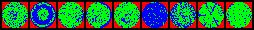
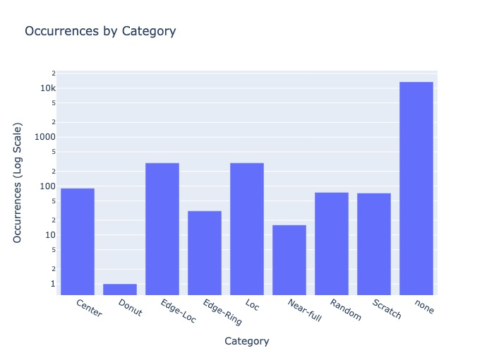

# Deep Learning Classifier for Silicon Wafer Maps

<p align="center">
  >
</p>

## Problem Statement

This project addresses quality control in silicon wafers, which involves identifying defects or not on the surface of a wafer. The goal is to produce a computer vision model that takes as input a silicon wafer maps and outputs a class.

<p align="center">
  
</p>

## Dataset Description

The classifier is trained on waferImg26x26 which consists of:

- **Number of samples**: 14366 samples
- **Classes**: ['Center', 'Donut', 'Edge-Loc', 'Edge-Ring', 'Loc', 'Near-full', 'Random', 'Scratch', 'none']
- **Source**: https://drive.google.com/file/d/1DBkX1saFrurCQDeZhdngA_qbY8QqmGRN/view?usp=sharing

### Occurences of classes
<p align="center">
  
</p>

## Solution

### Model architecture
The approach utilizes a deep learning model trained in PyTorch to classify wafer maps. The architecture includes:

        self.conv1 = nn.Conv2d(3, 32, 3, stride=1, padding=(1,1))
        self.conv2 = nn.Conv2d(32, 32, 3, stride=1, padding=(1,1))
        self.pool1 = nn.MaxPool2d(2)
        self.conv3 = nn.Conv2d(32, 64, 3, stride=1, padding=(1,1))
        self.conv4 = nn.Conv2d(64, 64, 3, stride=1, padding=(1,1))
        self.pool2 = nn.MaxPool2d(2)
        self.fc1 = nn.Linear(3*3*256, 512)
        self.dropout1 = nn.Dropout(p=0.5)
        self.fc2 = nn.Linear(512, 9)
        self.softmax = nn.LogSoftmax(dim=1)

### Data preparation
  1. Spliting the dataset in three sub sets: training, validation and test.
  2. Make sure 'Donut' class in included in dataset since it has a very low occurence.
  3. Create custom dataset inheriting the Dataset class of PyTorch.
  4. Use a weighted sampler for training data to avoid bias towards class with higher occurences.
  5. Perform Normalization on input data.
  6. Perform augmentation transform for all classes except the 'none' class (which represents over 90% of the dataset).

### Training parameters

| Type | Value |
| -------- | -------- |
| Optimizer   | Adam |
| Loss criteria  | Negative log likelihood |
| Batch size  | 64 |
| Learning rate  | 0.001 |
| Epochs  | 12 |
| Seed  | 40 |

### Optimization model and hyperparameters with tensorboard

TODO: Add explanation for tensorboard.

## Results

The model achieves the following performance metrics:

| Metric | Value |
|--------|-------|
| Accuracy validation | 98.6% |
| Accuracy test | 99.0% |

TODO: Add other metrics.

## How to Run the Code

1. Clone this repository:
   ```
   git clone https://github.com/gn3112/wafer-classifier.git
   ```

2. Install dependencies:
   ```
   pip install -r requirements_pip.txt
   ```
   OR
   ```
   conda install --file requirements.txt
   ```
   
3. Train the model:
   ```
   python main.py
   ```

4. Test the model:
   ```
   python test_model.py
   ```

## Credits

## License

This project is licensed under the [License Name] - see the [LICENSE.md](LICENSE.md) file for details.
